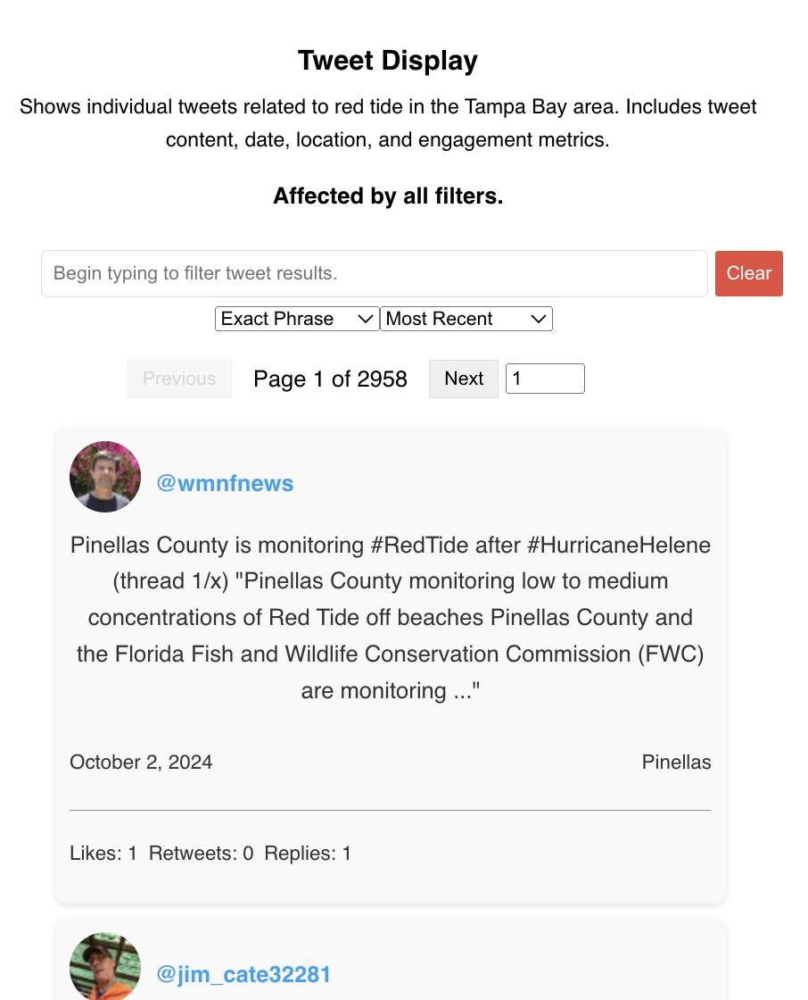

# TBRTD: Tampa Bay Red Tide Dash Board
**Description**:   
A Dashboard made to help people, researchers, etc be informed about anything red tide. 
Funded by the Tampa Bay Estuary Program and developed at New College of Florida. 

**Data Description**:
All the data is publicly available data retrieved on a weekly basis from X.com (previously Twitter). 

**What it currently Looks like:**
Link: https://tbenv-p5lmuhpiea-uc.a.run.app/ 

## Features: 
### Twitter Scroller:
- Displays all Tweets.
- You're able to search for terms in the tweets by writing the word in the serach bar.
- You're able to utilize advanced searching by picking your desired combination: Exact Match, AND, OR.
- You can look at a list that includes retweets or one without them. 
- You are able to sort the tweets by recency or any other metrics related to the tweets

### Word Cloud:
Depending on which word cloud type you pick from the filter menu:
- You can hover over the words to see how many times they were mentioned
- You can click a word and the tweets will filter to show which tweets has them 

### heatmap:
Shows you how many tweets are about each county. 
- You can hover the map to see the raw count of tweets per county 
- This Component is meant to give you a bird's eye view of the total tweets per county across the entire time line

### Time series:
Shows you how many tweets per county per day, over the entire database. 
- You can click and drag in order to zoom in on a given time frame 
- You can double-click to return to the original state 
- You can hover in order to see the date and the counts per county in the legend 

  
